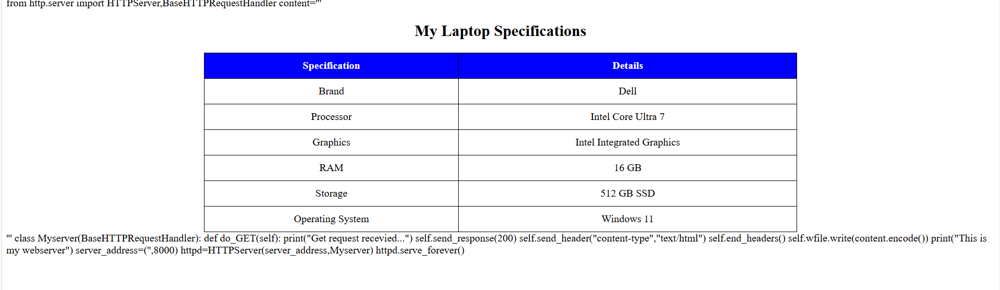

# EX01 Developing a Simple Webserver

# Date:
# AIM:
To develop a simple webserver to serve html pages and display the configuration details of laptop.

# DESIGN STEPS:
## Step 1:
HTML content creation.

## Step 2:
Design of webserver workflow.

## Step 3:
Implementation using Python code.

## Step 4:
Serving the HTML pages.

## Step 5:
Testing the webserver.

# PROGRAM:
```
from http.server import HTTPServer,BaseHTTPRequestHandler
content='''
<html>
<head>
    <title>My Laptop Specifications</title>
    <style>
        table {
            margin-left: auto;
            margin-right: auto;
            border-collapse: collapse;
            width: 60%;
        }
        table th, td {
            border: 1px solid black;
            padding: 10px;
            text-align: center;
        }
        th {
            background-color: blue ;
            color: white;
        }
        h2
        {
            text-align: center;
        }
    </style>
</head>
<body>

    <h2>My Laptop Specifications</h2>

    <table>
        <tr>
            <th>Specification</th>
            <th>Details</th>
        </tr>
        <tr>
            <td>Brand</td>
            <td>Dell</td>
        </tr>
        <tr>
            <td>Processor</td>
            <td>Intel Core Ultra 7</td>
        </tr>
        <tr>
            <td>Graphics</td>
            <td>Intel Integrated Graphics</td>
        </tr>
        <tr>
            <td>RAM</td>
            <td>16 GB</td>
        </tr>
        <tr>
            <td>Storage</td>
            <td>512 GB SSD</td>
        </tr>
        <tr>
            <td>Operating System</td>
            <td>Windows 11</td>
        </tr>
    </table>

</body>
</html>'''
class Myserver(BaseHTTPRequestHandler):
    def do_GET(self):
        print("Get request recevied...")
        self.send_response(200)
        self.send_header("content-type","text/html")
        self.end_headers()
        self.wfile.write(content.encode())
print("This is my webserver")
server_address=('',8000)
httpd=HTTPServer(server_address,Myserver)
httpd.serve_forever()
```

# OUTPUT:

# RESULT:
Thus the simple webserver is created.
